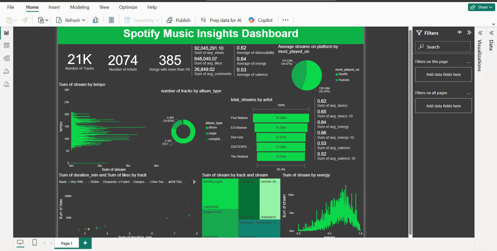

# 🎧 Spotify Music Insights Project — SQL + Power BI

This project presents an end-to-end analysis of Spotify's most streamed music using **PostgreSQL** (via **pgAdmin 4**) and **Power BI**. It explores artist popularity, audio features, user engagement, and platform performance across Spotify and YouTube.

---

## 📌 Project Objectives

- 🔍 Analyze track metadata like danceability, energy, and tempo
- 📈 Explore trends in engagement: views, likes, comments
- ⚙️ Compare streaming performance across platforms (Spotify vs YouTube)
- 🧠 Identify high-performing artists and tracks
- 📊 Visualize all findings in a professional Power BI dashboard

---

## 🛠 Tools & Technologies

- 🐘 **PostgreSQL** (via **pgAdmin 4**) – for SQL querying and analysis  
- 📊 **Power BI** – for interactive visualizations  
- 💻 **GitHub** – for version control and project sharing

---

## 📁 Dataset Overview

The dataset contains detailed metadata, audio features, and engagement stats for popular music tracks. Key fields include:

| Column              | Description |
|---------------------|-------------|
| `artist`            | Artist name |
| `track`             | Track title |
| `album`             | Album name |
| `album_type`        | Album, single, compilation |
| `danceability`      | How danceable a track is |
| `energy`            | Energy intensity of the track |
| `valence`           | Positiveness of the track |
| `tempo`             | Beats per minute |
| `views`, `likes`, `comments` | YouTube engagement stats |
| `stream`            | Spotify stream count |
| `official_video`    | Whether it's an official music video |
| `most_played_on`    | Most streamed platform (Spotify or YouTube) |

---

## 📊 Analytical Questions Answered

Using SQL views, the following questions were explored:

1. 🧮 How many tracks and unique artists are in the dataset?  
2. 🔥 Which songs have over 1 billion streams?  
3. 📊 What are the min, max, and average for views, likes, and comments?  
4. 💽 How are streams distributed by album type?  
5. 🏆 Who are the top 5 most streamed artists and tracks?  
6. 🟢 How do Spotify and YouTube compare in terms of streams?  
7. 🎧 What are the average audio features across all tracks?  
8. 🚀 How do the top 10% streamed tracks compare in features?  
9. ❤️ What’s the engagement ratio (likes/views, comments/views) per track?  
10. 🎚 Are there patterns between streams and features like energy, tempo, or danceability?

---

## 🧼 Data Cleaning

Basic cleaning was performed in SQL:

- Removed tracks with `duration_min = 0`
- Explored and standardized values in:
  - `album_type`
  - `most_played_on`
  - `channel`

---

## 📈 Power BI Dashboard

Insights were visualized in Power BI using the cleaned and analyzed data. The dashboard contains filters, KPIs, charts, and scatter plots.

> 📷 **Dashboard Preview**  
> Replace the image path below with your actual file name.

### Key Visuals Included:

- Top artists and most streamed tracks  
- Streams by platform (Spotify vs YouTube)  
- Audio features like energy, danceability, and valence  
- Engagement stats (likes, comments, views)  
- Platform comparison and high-level KPIs  
- Feature analysis of top 10% streamed tracks

---

## 💡 Key Insights

- **Top Artists**: Post Malone, Ed Sheeran, Dua Lipa, The Weeknd  
- **Most Streamed Track**: *Blinding Lights*  
- **Platform Dominance**: Spotify had ~56% of total streams  
- **Track Traits That Perform Well**: High energy, high danceability, and positive valence  
- **Engagement**: Some tracks have strong like-to-view and comment-to-view ratios
